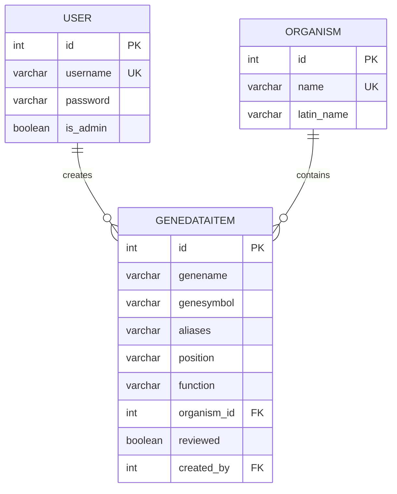
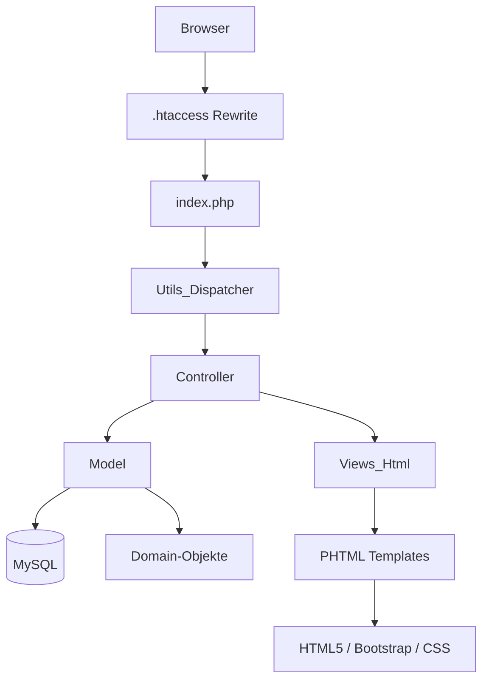

# Projektdokumentation GeneData

> Autor: Christopher Bleier | Eva Luftensteiner | Samuel Süss  

## Start-URL

Die Anwendung wird lokal über XAMPP ausgeführt und ist über folgende URLs erreichbar:

- Login / Einstieg: `http://localhost/geneData/Login`
- Hauptseite der Gene-Datenbank: `http://localhost/geneData/GeneDataItem`
- Registrierung: `http://localhost/geneData/Register`
- Benutzerverwaltung für Administratoren: `http://localhost/geneData/Admin/users`

## Kurzbeschreibung

GeneData ist eine PHP-Webanwendung zur Verwaltung genetischer Datensätze. Die Anwendung erlaubt das Anzeigen, Erstellen, Bearbeiten und Löschen von Genen. Benutzer können sich registrieren und einloggen. Je nach Rolle stehen unterschiedliche Funktionen zur Verfügung.

Anonyme Benutzer können die vorhandenen Gene ansehen und sich über eine eigene Registrierungsseite anmelden. Eingeloggte Benutzer können Gene verwalten. Administratoren haben zusätzlich Zugriff auf die Benutzerverwaltung, in der Benutzer gelöscht und deren Rolle zwischen normalem Benutzer und Administrator geändert werden kann.

Die Umsetzung erfolgt mit PHP 8, MySQL, PDO, HTML5, CSS und Bootstrap. JavaScript wird nur für Komfortfunktionen verwendet, zum Beispiel für das Sortieren der Gene-Tabelle und für Delete-Requests.

## Architektur der Anwendung

Die Anwendung folgt grundsätzlich dem MVC-Pattern. Dadurch sind Routing, Geschäftslogik, Datenbankzugriff und Darstellung voneinander getrennt.

```text
Browser
  |
  v
.htaccess
  |
  v
index.php
  |
  v
Utils_Dispatcher
  |
  +--> Controller
  |       |
  |       v
  |     Model ----> MySQL
  |       |
  |       v
  |     Domain-Objekte
  |
  v
Views / Templates
  |
  v
HTML-Ausgabe
```

### Routing und Einstiegspunkt

Alle Requests werden durch die `.htaccess` an `index.php` weitergeleitet. In `index.php` wird zuerst die Session gestartet. Danach registriert die Anwendung einen Autoloader, damit Klassen automatisch aus der Ordnerstruktur geladen werden können.

Der eigentliche Request wird anschließend an `Utils_Dispatcher` übergeben. Der Dispatcher analysiert die URL und entscheidet, welcher Controller und welche Methode ausgeführt werden müssen.

Beispiel:

```text
/geneData/GeneDataItem/5
```

Daraus wird:

- Ressource: `GeneDataItem`
- Controller: `Controllers_GeneDataItem`
- Parameter: `5`
- Methode: je nach HTTP-Methode, zum Beispiel `get()`

### Controller-Schicht

Controller steuern den Ablauf der Anwendung. Sie lesen Request-Daten, prüfen Berechtigungen, rufen Models auf und geben die Daten an die Views weiter.

| Controller | Aufgabe |
|---|---|
| `Controllers_GeneDataItem` | CRUD-Funktionen für Gene |
| `Controllers_Login` | Login und Gastzugang |
| `Controllers_Register` | Registrierung neuer Benutzer |
| `Controllers_Admin` | Benutzerverwaltung, Benutzer löschen, Admin-Rolle setzen/entfernen |
| `Controllers_Logout` | Session beenden |

### Model-Schicht

Models kapseln alle Datenbankzugriffe. Die Controller greifen nicht direkt auf die Datenbank zu, sondern verwenden die Models. Für dynamische Werte werden PDO Prepared Statements verwendet.

| Model | Aufgabe |
|---|---|
| `Models_GeneDataItem` | Lesen, Erstellen, Bearbeiten und Löschen von Genen |
| `Models_User` | Login, Registrierung, Benutzerliste, Benutzerlöschung und Rollenverwaltung |
| `Models_Organism` | Laden der Organismen für Auswahlfelder |
| `Models_Base` | Stellt die gemeinsame PDO-Verbindung bereit |

### Domain-Schicht

Domain-Klassen repräsentieren die fachlichen Objekte der Anwendung. Sie nehmen Daten aus der Datenbank entgegen und stellen sie der restlichen Anwendung als Objekte bereit.

| Domain | Bedeutung |
|---|---|
| `Domains_GeneDataItem` | Ein Gen-Datensatz |
| `Domains_User` | Ein Benutzerkonto |
| `Domains_Organism` | Ein Organismus |

### View-Schicht

Die View-Schicht erzeugt die HTML-Ausgabe. `Views_Html` entscheidet anhand der Ressource und der Daten, welches Template geladen wird. Wiederverwendbare Bestandteile wie Header und Footer liegen in eigenen Template-Dateien.

| Template | Aufgabe |
|---|---|
| `GeneDataItem/table.phtml` | Tabellenansicht aller Gene |
| `GeneDataItem/object.phtml` | Detailansicht eines Gens |
| `create.phtml` | Formular zum Erstellen oder Bearbeiten eines Gens |
| `login.phtml` | Login-Seite |
| `register.phtml` | Registrierungsseite |
| `Admin/table.phtml` | Benutzerverwaltung |

## Rollen und Berechtigungen

Die Anwendung unterscheidet drei Benutzerarten:

| Rolle | Rechte |
|---|---|
| Anonymer Benutzer / Gast | Gene anzeigen, Details ansehen, Registrierung und Login verwenden |
| Eingeloggter Benutzer | Gene anzeigen, erstellen, bearbeiten und löschen |
| Administrator | Alle Benutzerrechte plus Benutzerverwaltung, Benutzer löschen und Admin-Rolle ändern |

Die aktuelle Rolle wird serverseitig über die Session gespeichert. Hilfsfunktionen in `Utils_Login` prüfen, ob ein Benutzer eingeloggt ist oder Adminrechte besitzt. Kritische Aktionen wie Löschen, Bearbeiten oder Rollenverwaltung werden im Controller serverseitig geprüft.

## CRUD-Umsetzung für die Ressource Gene

Die Ressource `GeneDataItem` unterstützt alle CRUD-Operationen:

| CRUD | HTTP / Aktion | Umsetzung |
|---|---|---|
| Create | Formular absenden | Neues Gen wird über `Models_GeneDataItem::insert()` gespeichert |
| Read | Tabellen- und Detailansicht | Gene werden über `findAll()` und `findById()` geladen |
| Update | Bearbeitungsformular absenden | Bestehendes Gen wird über `update()` aktualisiert |
| Delete | Delete-Button | Gen wird über `delete()` gelöscht |

Damit erfüllt die Anwendung die Anforderung, für mindestens eine Ressource alle CRUD-Operationen bereitzustellen.

## Datenbankmodell

Die Datenbank `team_01` besteht aus drei zentralen Tabellen:

- `user`
- `organism`
- `genedataitem`

### Tabelle `user`

Die Tabelle `user` speichert Benutzerkonten und Rolleninformationen.

| Spalte | Typ | Beschreibung |
|---|---|---|
| `id` | INT, Primary Key, Auto Increment | Eindeutige Benutzer-ID |
| `username` | VARCHAR(30), UNIQUE | Benutzername |
| `password` | VARCHAR(65) | Passwort-Hash |
| `is_admin` | BOOLEAN | Admin-Status |

### Tabelle `organism`

Die Tabelle `organism` speichert Organismen, denen Gene zugeordnet werden.

| Spalte | Typ | Beschreibung |
|---|---|---|
| `id` | INT, Primary Key, Auto Increment | Eindeutige Organismus-ID |
| `name` | VARCHAR(150), UNIQUE | Allgemeiner Name |
| `latin_name` | VARCHAR(150), nullable | Lateinischer Name |

### Tabelle `genedataitem`

Die Tabelle `genedataitem` speichert die Gen-Datensätze.

| Spalte | Typ | Beschreibung |
|---|---|---|
| `id` | INT, Primary Key, Auto Increment | Eindeutige Gen-ID |
| `genename` | VARCHAR(255) | Name des Gens |
| `genesymbol` | VARCHAR(100) | Kurzsymbol des Gens |
| `aliases` | VARCHAR(255), nullable | Alternative Namen |
| `position` | VARCHAR(100) | Chromosomale Position |
| `function` | VARCHAR(500), nullable | Beschreibung der Funktion |
| `organism_id` | INT, Foreign Key | Verweis auf `organism.id` |
| `reviewed` | BOOLEAN | Gibt an, ob der Datensatz geprüft wurde |
| `created_by` | INT, Foreign Key, nullable | Verweis auf `user.id` |

Wenn ein Benutzer gelöscht wird, bleiben seine Gene erhalten. Der Fremdschlüssel `created_by` wird in diesem Fall auf `NULL` gesetzt. In der Anzeige wird dieser Fall als `Deleted user` dargestellt.

## Manuelles ER-Diagramm

Das folgende ER-Diagramm wurde manuell auf Basis des Datenbankmodells erstellt. Es visualisiert die Entitäten und deren Beziehungen.



Beziehungen:

- Ein `organism` kann mehreren `genedataitem`-Einträgen zugeordnet sein.
- Ein `genedataitem` gehört genau zu einem `organism`.
- Ein `user` kann mehrere `genedataitem`-Einträge erstellt haben.
- Ein `genedataitem` kann optional einen `user` als Ersteller besitzen. Nach dem Löschen eines Benutzers ist `created_by` `NULL`.

## Dokumentierte Architektur-Skizze



Diese Skizze zeigt den technischen Ablauf einer Anfrage. Der Browser sendet einen Request an die Anwendung. Die `.htaccess` leitet den Request an `index.php` weiter. Der Dispatcher entscheidet anhand der URL, welcher Controller geladen wird. Der Controller verarbeitet die Anfrage, nutzt bei Bedarf ein Model für den Datenbankzugriff und gibt das Ergebnis an die View weiter.

## Wichtige Anwendungsabläufe

### Login

1. Benutzer ruft `/geneData/Login` auf.
2. Das Login-Formular sendet Benutzername und Passwort an den Login-Controller.
3. `Models_User::login()` sucht den Benutzer per Prepared Statement.
4. Das Passwort wird mit `password_verify()` geprüft.
5. Bei erfolgreichem Login werden Benutzer-ID, Benutzername und Admin-Status in der Session gespeichert.

### Registrierung

1. Anonymer Benutzer ruft `/geneData/Register` auf.
2. Das Registrierungsformular sendet Benutzername und Passwort an den Register-Controller.
3. Das Passwort wird mit `password_hash()` gehasht.
4. Das User-Model prüft, ob der Benutzername bereits existiert.
5. Danach wird der neue Benutzer gespeichert.

### Gen erstellen

1. Eingeloggter Benutzer ruft das Formular zum Erstellen eines Gens auf.
2. Die vorhandenen Organismen werden aus der Datenbank geladen.
3. Der Benutzer füllt die Gen-Daten aus.
4. Der Controller validiert die Eingaben serverseitig.
5. Das Model speichert den neuen Datensatz in `genedataitem`.

### Gen bearbeiten

1. Eingeloggter Benutzer öffnet die Bearbeitungsansicht eines vorhandenen Gens.
2. Die aktuellen Werte werden aus der Datenbank geladen und im Formular angezeigt.
3. Nach dem Absenden prüft der Controller die Eingaben.
4. Das Model aktualisiert den bestehenden Datensatz per Prepared Statement.
5. Danach wird die aktualisierte Detailansicht angezeigt.

### Gen löschen

1. Eingeloggter Benutzer klickt in der Gene-Tabelle auf den Delete-Button.
2. JavaScript sendet einen `DELETE`-Request an die Anwendung.
3. Der Controller prüft, ob der Benutzer eingeloggt ist.
4. Das Model löscht den Gen-Datensatz aus der Datenbank.

### Benutzerverwaltung

1. Administrator ruft `/geneData/Admin/users` auf.
2. Die Anwendung prüft serverseitig, ob der aktuelle Benutzer Adminrechte besitzt.
3. Die Benutzerliste wird geladen und angezeigt.
4. Administratoren können Benutzer löschen.
5. Administratoren können die Rolle eines Benutzers zwischen normalem Benutzer und Admin umschalten.

## Sicherheit

Die Anwendung berücksichtigt folgende Sicherheitsaspekte:

- Datenbankzugriffe mit Benutzereingaben erfolgen über PDO Prepared Statements.
- Passwörter werden gehasht und nicht im Klartext gespeichert.
- Kritische Aktionen werden serverseitig auf Rollen und Login-Status geprüft.
- Textuelle Benutzereingaben werden serverseitig validiert.
- Textuelle Ausgaben aus Benutzereingaben werden mit `htmlspecialchars()` für HTML escaped.
- Fremdschlüssel und Constraints schützen die Datenintegrität in der Datenbank.

## Frontend und Bedienung

Das Frontend verwendet HTML5, CSS und Bootstrap. Die Seiten sind so aufgebaut, dass Benutzer ohne zusätzliche Erklärung durch die Anwendung navigieren können. Wichtige Aktionen sind über Buttons und Navigationslinks erreichbar.

JavaScript wird nicht für sicherheitsrelevante Validierung eingesetzt. Es dient nur der Bedienbarkeit, zum Beispiel:

- Sortieren der Gene-Tabelle per Klick auf eine Spaltenüberschrift
- Anzeige der aktuell sortierten Spalte über Pfeile
- Senden von Delete-Requests ohne separates Formular