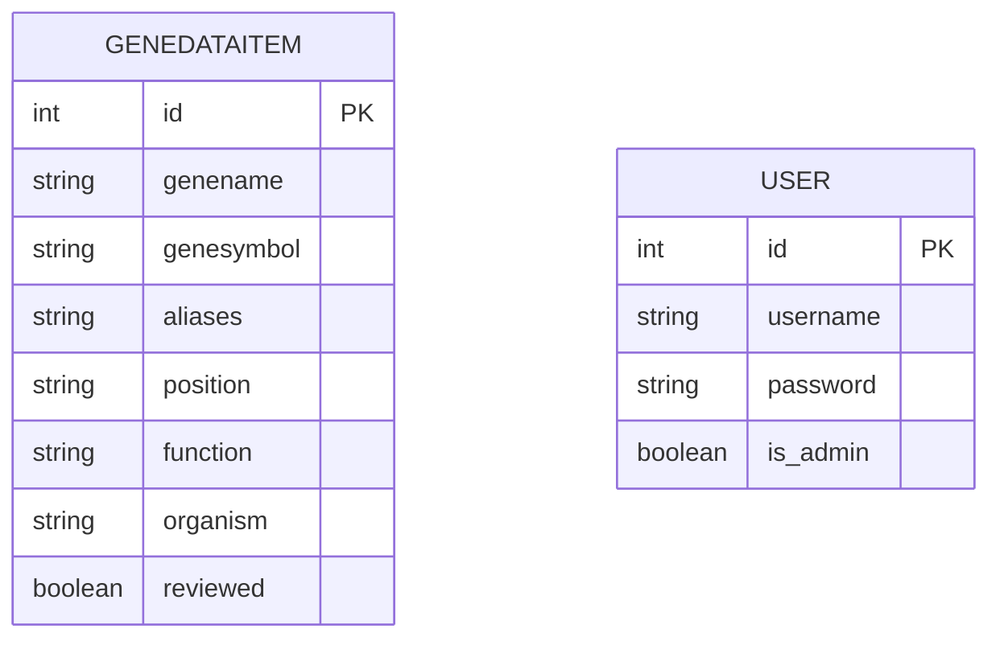

# Datenbankdokumentation team_01

## Überblick

Die Datenbank enthält genetische Datensätze sowie Benutzerkonten. Die Gendaten werden in der Applikation als Tabellenform angezeigt, es soll auch eine Detailansicht geben, die alle Felder der Tabelle anzeigt. Die Usertabelle ist primär für die Userverwaltung zuständig. In der Applikation kann man aber auch als Gast angemeldet sein.

Tabellen:
- `genedataitem`: Gene und biologische Informationen
- `user`: Benutzerverwaltung

---

## Tabelle: `genedataitem`

Speichert Gene verschiedener Organismen.

| Spalte      | Typ            | Beschreibung |
|------------|---------------|-------------|
| id         | INT PK AI     | Eindeutige ID |
| genename   | VARCHAR(255)  | Genname |
| genesymbol | VARCHAR(100)  | Gensymbol |
| aliases    | VARCHAR(255)  | Alternativnamen |
| position   | VARCHAR(100)  | Chromosomale Position |
| function   | VARCHAR(500)  | Funktion |
| organism   | VARCHAR(150)  | Organismus |
| reviewed   | BOOLEAN       | Prüfstatus |

---

## Tabelle: `user`

Benutzerverwaltung mit Rollen.

| Spalte    | Typ           | Beschreibung |
|----------|--------------|-------------|
| id       | INT PK AI    | Benutzer-ID |
| username | VARCHAR(30)  | Eindeutig |
| password | VARCHAR(65)  | bcrypt-Hash |
| is_admin | BOOLEAN      | Admin-Flag |

---

## Sicherheit

- Passwörter werden als bcrypt-Hashes gespeichert
- Admin-Rechte über `is_admin`
- `username` ist eindeutig

---

## Beziehungen

- Keine Fremdschlüssel vorhanden
- Tabellen sind unabhängig

---

## ER-Diagramm (Mermaid)

