# Projektdokumentation GeneData

> Autor: Christopher Bleier | Eva Luftensteiner | Samuel Süss  

## Start-URL

Die Anwendung wird lokal über XAMPP ausgeführt und ist über folgende URLs erreichbar:

- Login / Einstieg: `http://localhost/geneData/Login`
- Hauptseite der Gene-Datenbank: `http://localhost/geneData/GeneDataItem`
- Registrierung: `http://localhost/geneData/Register`
- Benutzerverwaltung für Administratoren: `http://localhost/geneData/Admin/users`

## Kurzbeschreibung

GeneData ist eine PHP-Webanwendung zur Verwaltung genetischer Datensätze. Die Anwendung erlaubt das Anzeigen, Erstellen, Bearbeiten und Löschen von Genen. Benutzer können sich registrieren und einloggen. Je nach Rolle stehen unterschiedliche Funktionen zur Verfügung.

Anonyme Benutzer können die vorhandenen Gene ansehen und sich über eine eigene Registrierungsseite anmelden. Eingeloggte Benutzer können Gene verwalten. Administratoren haben zusätzlich Zugriff auf die Benutzerverwaltung, in der Benutzer gelöscht und deren Rolle zwischen normalem Benutzer und Administrator geändert werden kann.

Die Umsetzung erfolgt mit PHP 8, MySQL, PDO, HTML5, CSS und Bootstrap. JavaScript wird nur für Komfortfunktionen verwendet, zum Beispiel für das Sortieren der Gene-Tabelle und für Delete-Requests.

## Architektur der Anwendung

Die Anwendung folgt grundsätzlich dem MVC-Pattern. Dadurch sind Routing, Geschäftslogik, Datenbankzugriff und Darstellung voneinander getrennt.

```text
Browser
  |
  v
.htaccess
  |
  v
index.php
  |
  v
Utils_Dispatcher
  |
  +--> Controller
  |       |
  |       v
  |     Model ----> MySQL
  |       |
  |       v
  |     Domain-Objekte
  |
  v
Views / Templates
  |
  v
HTML-Ausgabe
```

### Routing und Einstiegspunkt

Alle Requests werden durch die `.htaccess` an `index.php` weitergeleitet. In `index.php` wird zuerst die Session gestartet. Danach registriert die Anwendung einen Autoloader, damit Klassen automatisch aus der Ordnerstruktur geladen werden können.

Der eigentliche Request wird anschließend an `Utils_Dispatcher` übergeben. Der Dispatcher analysiert die URL und entscheidet, welcher Controller und welche Methode ausgeführt werden müssen.

Beispiel:

```text
/geneData/GeneDataItem/5
```

Daraus wird:

- Ressource: `GeneDataItem`
- Controller: `Controllers_GeneDataItem`
- Parameter: `5`
- Methode: je nach HTTP-Methode, zum Beispiel `get()`

### Controller-Schicht

Controller steuern den Ablauf der Anwendung. Sie lesen Request-Daten, prüfen Berechtigungen, rufen Models auf und geben die Daten an die Views weiter.

| Controller | Aufgabe |
|---|---|
| `Controllers_GeneDataItem` | CRUD-Funktionen für Gene |
| `Controllers_Login` | Login und Gastzugang |
| `Controllers_Register` | Registrierung neuer Benutzer |
| `Controllers_Admin` | Benutzerverwaltung, Benutzer löschen, Admin-Rolle setzen/entfernen |
| `Controllers_Logout` | Session beenden |

### Model-Schicht

Models kapseln alle Datenbankzugriffe. Die Controller greifen nicht direkt auf die Datenbank zu, sondern verwenden die Models. Für dynamische Werte werden PDO Prepared Statements verwendet.

| Model | Aufgabe |
|---|---|
| `Models_GeneDataItem` | Lesen, Erstellen, Bearbeiten und Löschen von Genen |
| `Models_User` | Login, Registrierung, Benutzerliste, Benutzerlöschung und Rollenverwaltung |
| `Models_Organism` | Laden der Organismen für Auswahlfelder |
| `Models_Base` | Stellt die gemeinsame PDO-Verbindung bereit |

### Domain-Schicht

Domain-Klassen repräsentieren die fachlichen Objekte der Anwendung. Sie nehmen Daten aus der Datenbank entgegen und stellen sie der restlichen Anwendung als Objekte bereit.

| Domain | Bedeutung |
|---|---|
| `Domains_GeneDataItem` | Ein Gen-Datensatz |
| `Domains_User` | Ein Benutzerkonto |
| `Domains_Organism` | Ein Organismus |

### View-Schicht

Die View-Schicht erzeugt die HTML-Ausgabe. `Views_Html` entscheidet anhand der Ressource und der Daten, welches Template geladen wird. Wiederverwendbare Bestandteile wie Header und Footer liegen in eigenen Template-Dateien.

| Template | Aufgabe |
|---|---|
| `GeneDataItem/table.phtml` | Tabellenansicht aller Gene |
| `GeneDataItem/object.phtml` | Detailansicht eines Gens |
| `create.phtml` | Formular zum Erstellen oder Bearbeiten eines Gens |
| `login.phtml` | Login-Seite |
| `register.phtml` | Registrierungsseite |
| `Admin/table.phtml` | Benutzerverwaltung |

## Rollen und Berechtigungen

Die Anwendung unterscheidet drei Benutzerarten:

| Rolle | Rechte |
|---|---|
| Anonymer Benutzer / Gast | Gene anzeigen, Details ansehen, Registrierung und Login verwenden |
| Eingeloggter Benutzer | Gene anzeigen, erstellen, bearbeiten und löschen |
| Administrator | Alle Benutzerrechte plus Benutzerverwaltung, Benutzer löschen und Admin-Rolle ändern |

Die aktuelle Rolle wird serverseitig über die Session gespeichert. Hilfsfunktionen in `Utils_Login` prüfen, ob ein Benutzer eingeloggt ist oder Adminrechte besitzt. Kritische Aktionen wie Löschen, Bearbeiten oder Rollenverwaltung werden im Controller serverseitig geprüft.

## CRUD-Umsetzung für die Ressource Gene

Die Ressource `GeneDataItem` unterstützt alle CRUD-Operationen:

| CRUD | HTTP / Aktion | Umsetzung |
|---|---|---|
| Create | Formular absenden | Neues Gen wird über `Models_GeneDataItem::insert()` gespeichert |
| Read | Tabellen- und Detailansicht | Gene werden über `findAll()` und `findById()` geladen |
| Update | Bearbeitungsformular absenden | Bestehendes Gen wird über `update()` aktualisiert |
| Delete | Delete-Button | Gen wird über `delete()` gelöscht |

Damit erfüllt die Anwendung die Anforderung, für mindestens eine Ressource alle CRUD-Operationen bereitzustellen.

## Datenbankmodell

Die Datenbank `team_01` besteht aus drei zentralen Tabellen:

- `user`
- `organism`
- `genedataitem`

### Tabelle `user`

Die Tabelle `user` speichert Benutzerkonten und Rolleninformationen.

| Spalte | Typ | Beschreibung |
|---|---|---|
| `id` | INT, Primary Key, Auto Increment | Eindeutige Benutzer-ID |
| `firstname` | VARCHAR(30) | Vorname des Benutzers |
| `lastname` | VARCHAR(30) | Nachname des Benutzers |
| `username` | VARCHAR(30), UNIQUE | Benutzername |
| `password` | VARCHAR(65) | Passwort-Hash |
| `is_admin` | BOOLEAN | Admin-Status |

### Tabelle `organism`

Die Tabelle `organism` speichert Organismen, denen Gene zugeordnet werden.

| Spalte | Typ | Beschreibung |
|---|---|---|
| `id` | INT, Primary Key, Auto Increment | Eindeutige Organismus-ID |
| `name` | VARCHAR(150), UNIQUE | Allgemeiner Name |
| `latin_name` | VARCHAR(150), nullable | Lateinischer Name |

### Tabelle `genedataitem`

Die Tabelle `genedataitem` speichert die Gen-Datensätze.

| Spalte | Typ | Beschreibung |
|---|---|---|
| `id` | INT, Primary Key, Auto Increment | Eindeutige Gen-ID |
| `genename` | VARCHAR(255) | Name des Gens |
| `genesymbol` | VARCHAR(100) | Kurzsymbol des Gens |
| `aliases` | VARCHAR(255), nullable | Alternative Namen |
| `position` | VARCHAR(100) | Chromosomale Position |
| `function` | VARCHAR(500), nullable | Beschreibung der Funktion |
| `organism_id` | INT, Foreign Key, NOT NULL | Verpflichtender Verweis auf `organism.id` |
| `reviewed` | BOOLEAN | Gibt an, ob der Datensatz geprüft wurde |
| `created_by` | INT, Foreign Key, nullable | Verweis auf `user.id` |

Wenn ein Benutzer gelöscht wird, bleiben seine Gene erhalten. Der Fremdschlüssel `created_by` wird in diesem Fall auf `NULL` gesetzt. In der Anzeige wird dieser Fall als `Deleted user` dargestellt.

## Manuelles ER-Diagramm

Das folgende ER-Diagramm wurde manuell auf Basis des Datenbankmodells erstellt. Es visualisiert die Entitäten und deren Beziehungen.

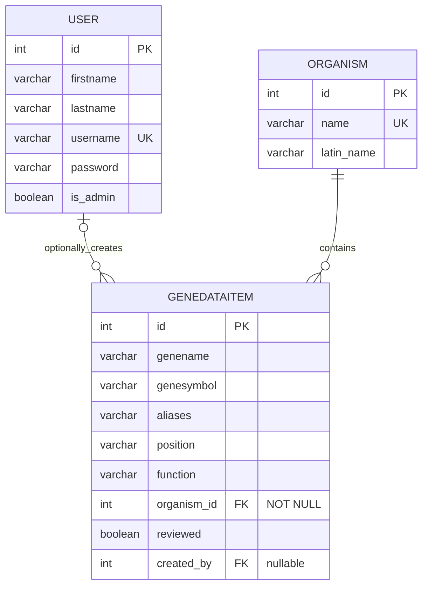
```mermaid
erDiagram
    USER |o--o{ GENEDATAITEM : optionally_creates
    ORGANISM ||--o{ GENEDATAITEM : contains

    USER {
        int id PK
        varchar firstname
        varchar lastname
        varchar username UK
        varchar password
        boolean is_admin
    }

    ORGANISM {
        int id PK
        varchar name UK
        varchar latin_name
    }

    GENEDATAITEM {
        int id PK
        varchar genename
        varchar genesymbol
        varchar aliases
        varchar position
        varchar function
        int organism_id FK "NOT NULL"
        boolean reviewed
        int created_by FK "nullable"
    }
```

Beziehungen:

- Ein `organism` kann mehreren `genedataitem`-Einträgen zugeordnet sein.
- Ein `genedataitem` gehört genau zu einem `organism`; `organism_id` ist deshalb verpflichtend und darf nicht `NULL` sein.
- Ein `user` kann mehrere `genedataitem`-Einträge erstellt haben.
- Ein `genedataitem` kann optional einen `user` als Ersteller besitzen; `created_by` darf `NULL` sein. Nach dem Löschen eines Benutzers wird `created_by` durch `ON DELETE SET NULL` auf `NULL` gesetzt.

## Dokumentierte Architektur-Skizze

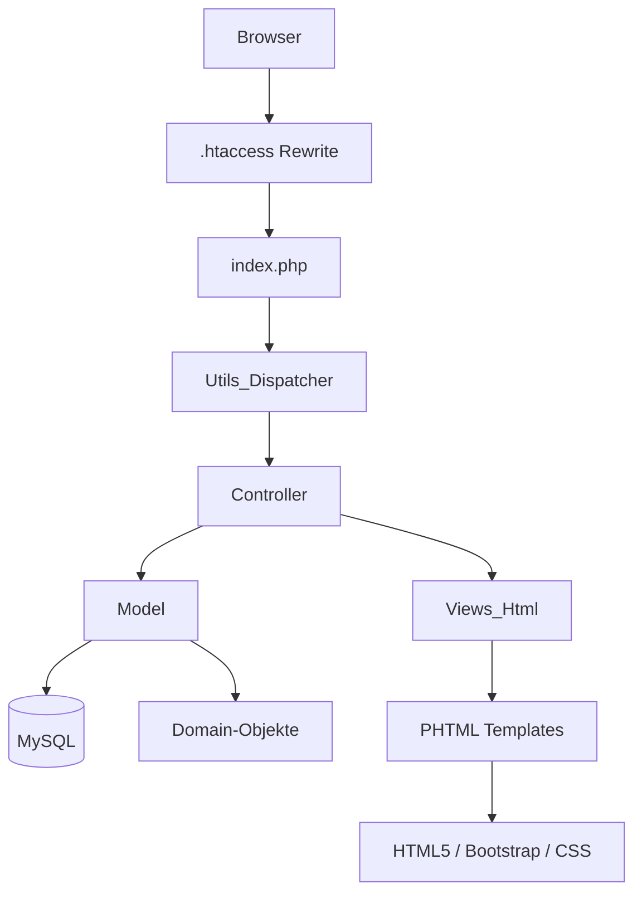
```mermaid
flowchart TD
    A[Browser] --> B[.htaccess Rewrite]
    B --> C[index.php]
    C --> D[Utils_Dispatcher]
    D --> E[Controller]
    E --> F[Model]
    F --> G[(MySQL)]
    F --> H[Domain-Objekte]
    E --> I[Views_Html]
    I --> J[PHTML Templates]
    J --> K[HTML5 / Bootstrap / CSS]
```

Diese Skizze zeigt den technischen Ablauf einer Anfrage. Der Browser sendet einen Request an die Anwendung. Die `.htaccess` leitet den Request an `index.php` weiter. Der Dispatcher entscheidet anhand der URL, welcher Controller geladen wird. Der Controller verarbeitet die Anfrage, nutzt bei Bedarf ein Model für den Datenbankzugriff und gibt das Ergebnis an die View weiter.

## Wichtige Anwendungsabläufe

### Login

1. Benutzer ruft `/geneData/Login` auf.
2. Das Login-Formular sendet Benutzername und Passwort an den Login-Controller.
3. `Models_User::login()` sucht den Benutzer per Prepared Statement.
4. Das Passwort wird mit `password_verify()` geprüft.
5. Bei erfolgreichem Login werden Benutzer-ID, Benutzername und Admin-Status in der Session gespeichert.

### Registrierung

1. Anonymer Benutzer ruft `/geneData/Register` auf.
2. Das Registrierungsformular sendet Benutzername und Passwort an den Register-Controller.
3. Das Passwort wird mit `password_hash()` gehasht.
4. Das User-Model prüft, ob der Benutzername bereits existiert.
5. Danach wird der neue Benutzer gespeichert.

### Gen erstellen

1. Eingeloggter Benutzer ruft das Formular zum Erstellen eines Gens auf.
2. Die vorhandenen Organismen werden aus der Datenbank geladen.
3. Der Benutzer füllt die Gen-Daten aus.
4. Der Controller validiert die Eingaben serverseitig.
5. Das Model speichert den neuen Datensatz in `genedataitem`.

### Gen bearbeiten

1. Eingeloggter Benutzer öffnet die Bearbeitungsansicht eines vorhandenen Gens.
2. Die aktuellen Werte werden aus der Datenbank geladen und im Formular angezeigt.
3. Nach dem Absenden prüft der Controller die Eingaben.
4. Das Model aktualisiert den bestehenden Datensatz per Prepared Statement.
5. Danach wird die aktualisierte Detailansicht angezeigt.

### Gen löschen

1. Eingeloggter Benutzer klickt in der Gene-Tabelle auf den Delete-Button.
2. JavaScript sendet einen `DELETE`-Request an die Anwendung.
3. Der Controller prüft, ob der Benutzer eingeloggt ist.
4. Das Model löscht den Gen-Datensatz aus der Datenbank.

### Benutzerverwaltung

1. Administrator ruft `/geneData/Admin/users` auf.
2. Die Anwendung prüft serverseitig, ob der aktuelle Benutzer Adminrechte besitzt.
3. Die Benutzerliste wird geladen und angezeigt.
4. Administratoren können Benutzer löschen.
5. Administratoren können die Rolle eines Benutzers zwischen normalem Benutzer und Admin umschalten.
6. User-IDs für Rollenänderungen und Löschvorgänge werden serverseitig als positive Integer geprüft und gegen die Datenbank validiert.

## Sicherheit

Die Anwendung berücksichtigt folgende Sicherheitsaspekte:

- Datenbankzugriffe mit Benutzereingaben erfolgen über PDO Prepared Statements.
- Passwörter werden gehasht und nicht im Klartext gespeichert.
- Kritische Aktionen werden serverseitig auf Rollen und Login-Status geprüft.
- Textuelle Benutzereingaben werden serverseitig validiert. Dazu gehören auch die Werte aus Formularen wie Login, Registrierung, Gen-Erstellung, Gen-Bearbeitung und Benutzerverwaltung.
- User-IDs in der Benutzerverwaltung werden serverseitig geprüft, bevor Benutzer gelöscht oder Rollen geändert werden.
- Textuelle Ausgaben aus Benutzereingaben und Datenbankwerten werden in den Views mit `htmlspecialchars()` für HTML escaped, damit gespeicherte Sonderzeichen nicht als HTML oder JavaScript ausgeführt werden.
- Fremdschlüssel und Constraints schützen die Datenintegrität in der Datenbank.

## Frontend und Bedienung

Das Frontend verwendet HTML5, CSS und Bootstrap. Die Seiten sind so aufgebaut, dass Benutzer ohne zusätzliche Erklärung durch die Anwendung navigieren können. Wichtige Aktionen sind über Buttons und Navigationslinks erreichbar.

JavaScript wird nicht für sicherheitsrelevante Validierung eingesetzt. Es dient nur der Bedienbarkeit, zum Beispiel:

- Sortieren der Gene-Tabelle per Klick auf eine Spaltenüberschrift
- Anzeige der aktuell sortierten Spalte über Pfeile
- Senden von Delete-Requests ohne separates Formular
- Ein- und Ausblenden von Passwörtern in Login- und Registrierungsformularen

## Testfälle

### User - Login / Register / Logout
Durch den "Continue as Guest" wird der aktuelle User weitergeleitet auf die Hautpseite. Es muss kein Benutzername oder Password eingegeben werden. Die Person ist aber auch nicht eingeloggt, daher steht auf der Hauptseite statt dem Logout Knopf ein Login Knopf. Da Guests keine Gene anlegen können, fehlt auch hierfür der Knopf.
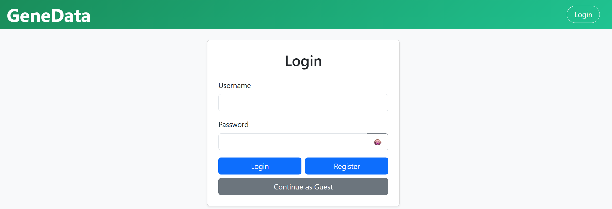


Wenn man ohne sich anzumelden direkt die Url der Hauptseite eingibt, ist man automatisch als Guest-User angemeldet. Dadurch sieht man auch die Ansicht eines Guest-Users.


User können sich durch das Eingeben ihres Benutzernamens und Passwort anmelden. Der aktuelle Testuser ist "sami" mit dem Passwort "pw".
Auf der Hauptseite eines eingeloggten Users ist ein Logout Knopf und ein "Add Gene" Knopf zu sehen.


Wenn beim Einloggen eines bestehenden Benutzers ein falsches Passwort oder ein falscher Benutzername eingegeben wird, sollte es zu einer Fehlermeldung kommen. 

Test mit einem falschen Passwort:<br>
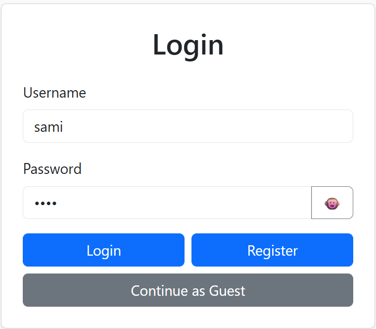
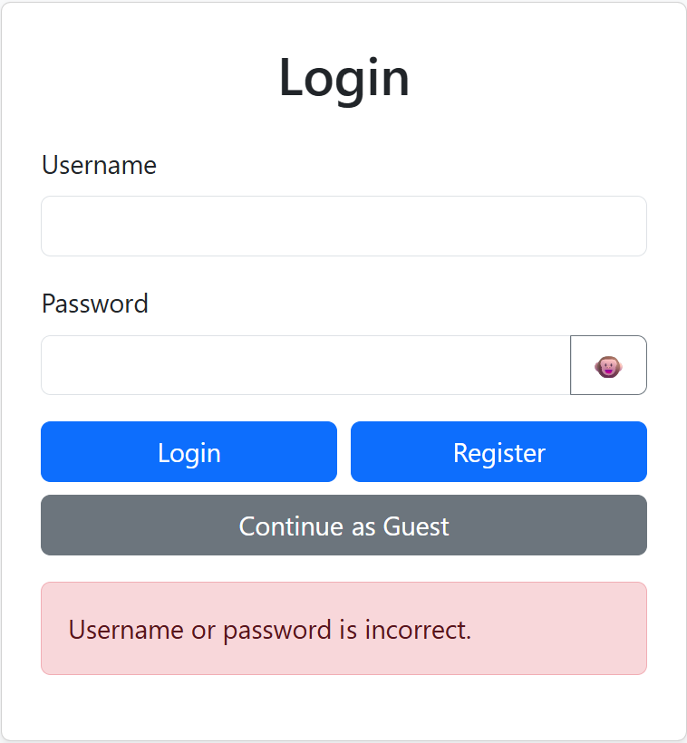

Test mit einem falschen Benutzernamen:<br>
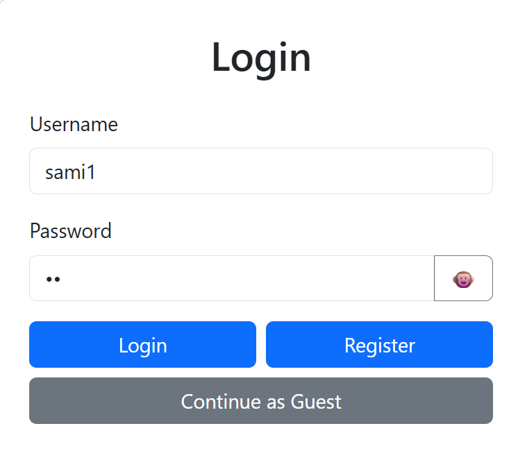


Eingaben mit einem fehlenden Passwort oder mit einem fehlenden Username führen auch zu einer Fehlermeldung.

Test mit einem fehlenden Passwort:<br>
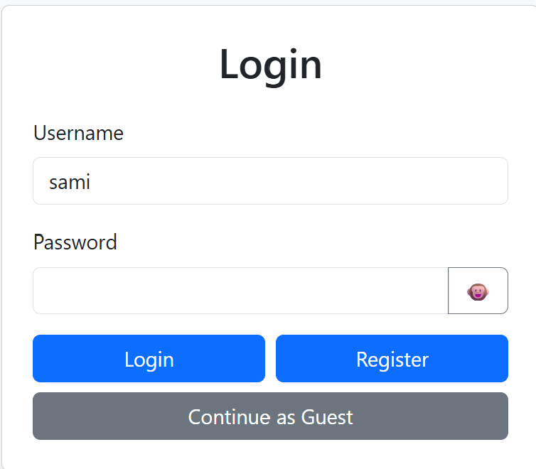
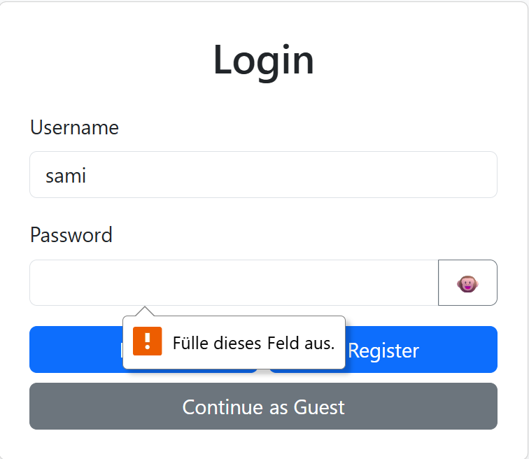

Test mit einem fehlenden Benutzernamen:<br>
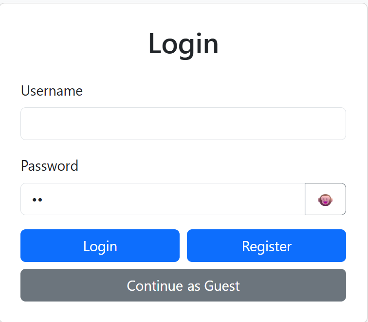
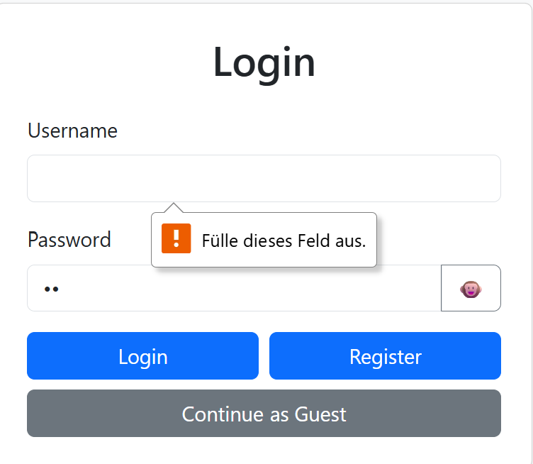

Der Login mit einem nicht existierendem Benutzer sollte zu einer Fehlermeldung führen. Das wäre der gleiche Fall wie bei einem falschen Benutzernamen.<br>
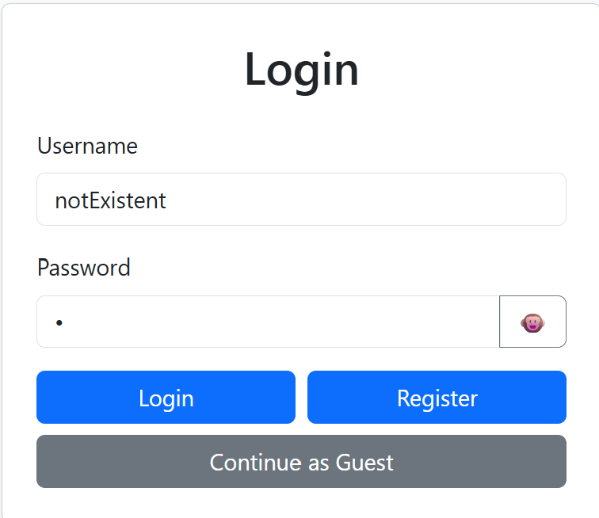
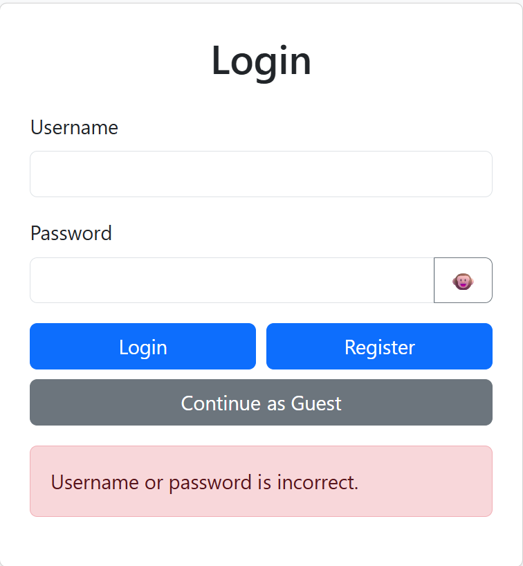

Der Login für Admins funktioniert so wie bei normalen Benutzern. Jedoch sehen Admins auf der Hauptseite, neben den Buttons für normale User, einen Knopf für das User-Management.
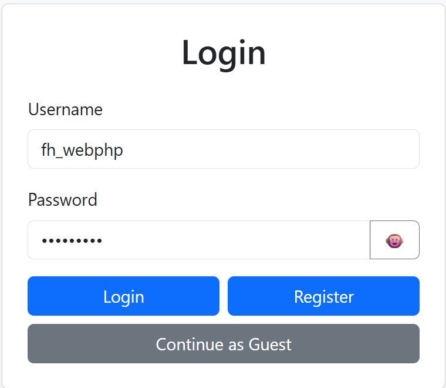


Neue User können sich selbst registrieren indem sie auf den "Register" Knopf drücken. Dadurch wird man auf eine Seite weitergeleitet, wo man den Vornamen, Nachnamen, Benutzernamen und ein Passwort eingeben muss.


Wenn alle Felder ausgewählt sind und auf "Register" gedrückt wird, wird man weitergeleitet auf die Login Seite. Der neue User sollte nun auch in der Datenbank erscheinen und man kann sich mit ihm anmelden.


Alle auszufüllenden Werte müssen durch den Benutzer bei der Registrierung ausgefüllt werden, ansonsten kommt es zu Fehlermeldungen.<br>


Auch das eingeben eines existierendem Benutzernamens sollte zu einer Fehlermeldung führen.<br>


Das Registrieren eines Users mit dem selben Vor- und Nachnamen sollte jedoch zu keinen Problemen führen und so erfolgreich durchlaufen. <br>


Eingeloggte Benutzer, also auch Admin, werden nachdem sie den "Logout" Knopf auf der Hauptseite gedrückt haben wieder auf die Login-Seite geschickt. Sie sind nun aber ausgeloggt, das heißt wenn sie auf die Hauptseite gehen, haben sie die Ansicht eines Guest-Users.
(Hier getestet mit einem Admin.)


### Admin Management
(Die Testuser beginnen mit der Id 4, da davor schon andere Testuser erstellt wurden. Diese wurden aber vor den Tests wieder gelöscht.)

Hier wird die Hauptseite für das User Management angezeigt. Es muss ein Admin eingelogt sein. Nur Admins sehen einen Button um zum User Management zu kommen.
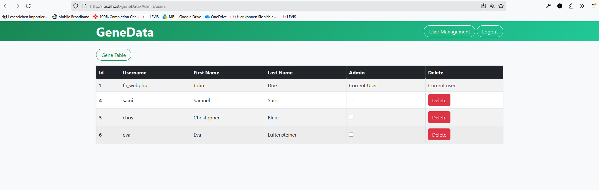

Das ist der aktuelle Stand der Datenbank in MySQL:
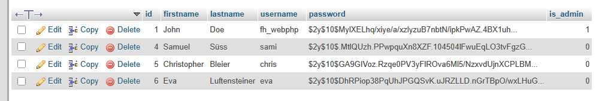

Ansicht für eingeloggte Admins:


Ansicht für guests:


Ansicht für eingeloggte User:


Wenn ein Nicht-Admin direkt auf die Seite geht, wird ein Fehler ausgegeben.
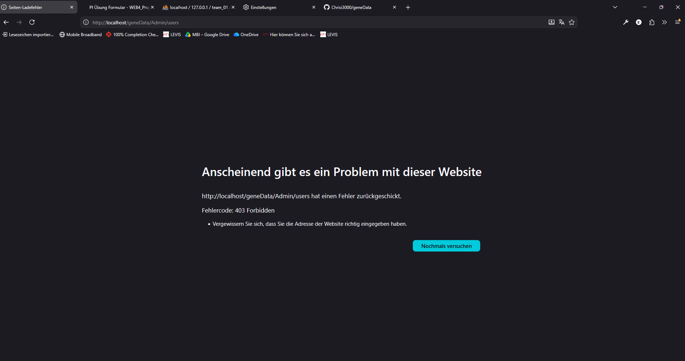

Das Anklicken der Checkbox bei Admin setzt einen User zu Admin/ändert den Admin zu einem normalen User. Dies ist aber nur möglich für User, die nicht der aktuelle User ist. Beim aktuellen User steht "Current User".
Bevor der State geändert wird, wird der aktuelle User gefragt, ob die Änderung durchgeführt werden soll.
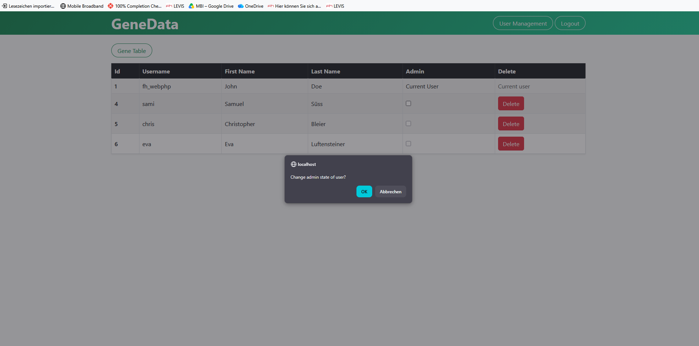

Wenn hier "Ok" gedrückt wird, wird der State des Users auf Admin gesetzt. In diesem Fall vom User "sami".
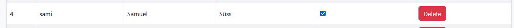
Nun würde man auch als "sami" auf die User-Management Seite kommen und könnte angemeldete User bearbeiten.
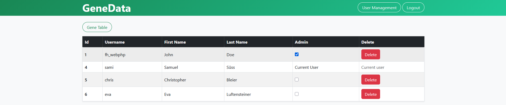

Wenn "Abbrechen" gedrückt wird, ändert sich nichts.
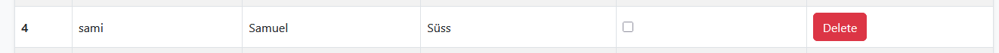

Eine aktivierte Checkbox kann durch erneutes Klicken wieder deaktiviert werden und somit der Admin State wieder auf false gesetzt werden.
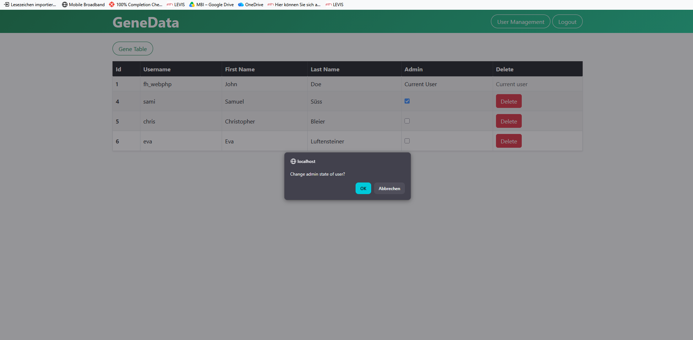

Wenn hier "Ok" gedrückt wird, wird der State des Users auf nicht-Admin gesetzt. In diesem Fall vom User "sami".
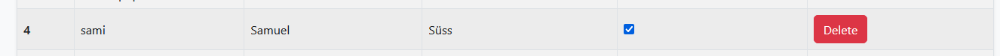

Wenn "Abbrechen" gedrückt wird, ändert sich nichts.
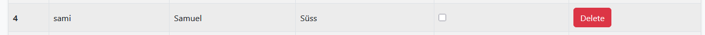

Das Löschen von Usern kann mit dem Delete-Button der Delete Spalte getätigt werden. Gleich wie beim Ändern des Admin-States kann dies nicht vom aktuellen User für sich selbst gemacht werden.
Dies ist der aktuelle Stand der Datenbank.
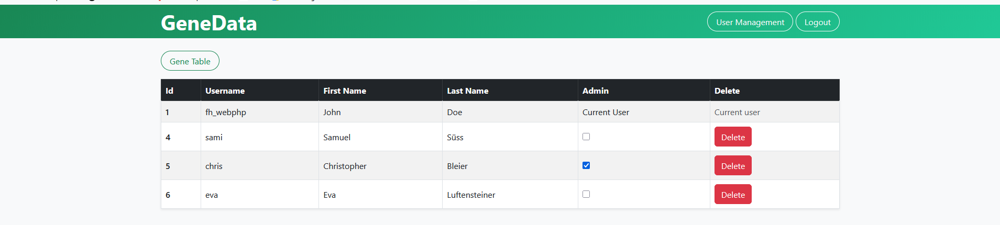
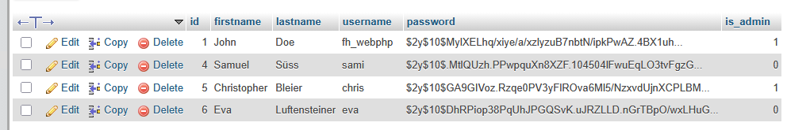

Vom aktuellen User können sowohl normale User als auch andere Admins gelöscht werden.
Das Löschen ruft wieder eine Meldung auf, ob die aktuelle Person gelöscht werden soll.
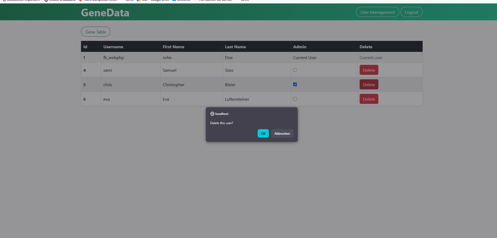

Wenn hier "Ok" gedrückt wird, wird der User gelöscht und nicht mehr in der Tabelle angezeigt. In diesem Fall "chris".
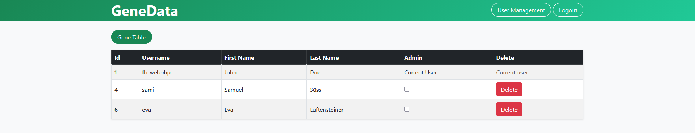
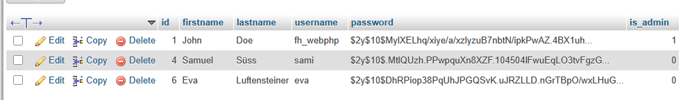

Wenn "Abbrechen" gedrückt wird, ändert sich nichts.
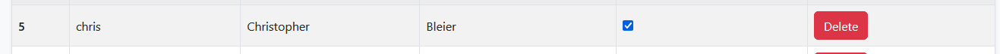
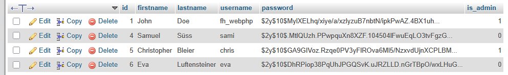

Das Löschen eines normalen Users funktioniert gleich, in diesem Fall "eva".
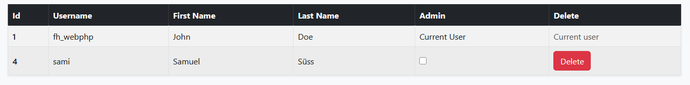
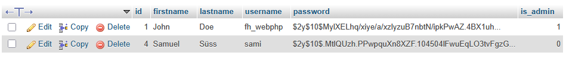


### Main Page - Table, Details, Delete Genes

Hier wird die Hauptseite mit der Gentabelle gezeigt. Hierbei sieht man die wichtigsten Spalten als Übersicht. Dabei ist ein Admin User eingeloggt, dementsprechend gibt es neben der Detail Ansicht auch die Auswahl zum Löschen oder Bearbeiten eines Gens, sowie zum Ergänzen eines neuen.


Die Tabelle ist standardmäßig aufsteigend nach ID sortiert. Mit Klick in eine Spaltenüberschrift kann man die Sortierung auf eine andere Spalte ändern, welche sowohl aufsteigend als auch absteigend sortiert sein kann.


Als nicht eingeloggter User ist dieselbe Tabelle zu sehen, aber nur mit der zusätzlichen Möglichkeit auf die Detailpage eines Gens zu navigieren.


Beim Löschen eines Gens kommt ein Pop-Up, um das Löschen zu bestätigen, damit Daten nicht durch einen ungewollten Mausklick verloren gehen können. Wird dies abgebrochen, bleibt das Gen gespeichert, sonst wird es aus der Tabelle und Datenbank gelöscht. (Gen mit ID 1 in diesem Beispiel)


Auf der Details Page können zu jedem einzelnen Gen alle gespeicherten Daten abgefragt werden. Hierbei ist der Link zu der Seite des jeweilgen Gens immer durch die ID gekennzeichnet.

``http://localhost/geneData/GeneDataItem/2`` 


Hierbei noch zum Beispiel die Detail Page eines neu erstellten Gens von dem User "Admin"


### Add / Update Gene

Das Add Formular lässt sich mit dem Knopf "Add Gene" öffnen:

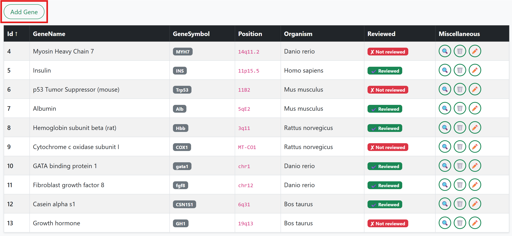

Das Formular sieht wie folgt aus:

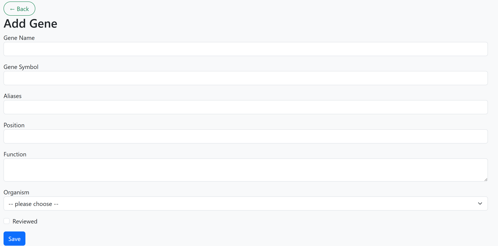

Gene Name, Gene Symbol und Organism muss man ausfüllen.

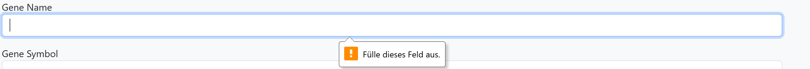

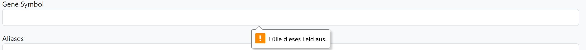

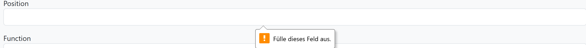

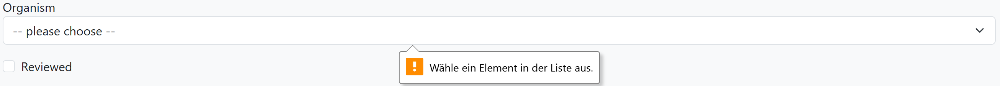

Das Drop-Down-Menü für Organism sieht so aus:

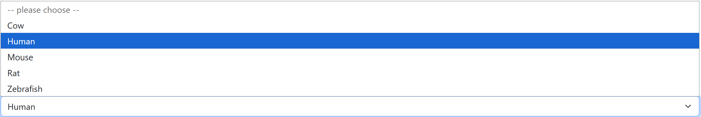

Füllt man das Formular aus und drückt man Save wird das Gen gespeichert


In der Detailansicht sieht man alle ausgefüllten Felder plus den User der bei der Erstellung eingeloggt war.

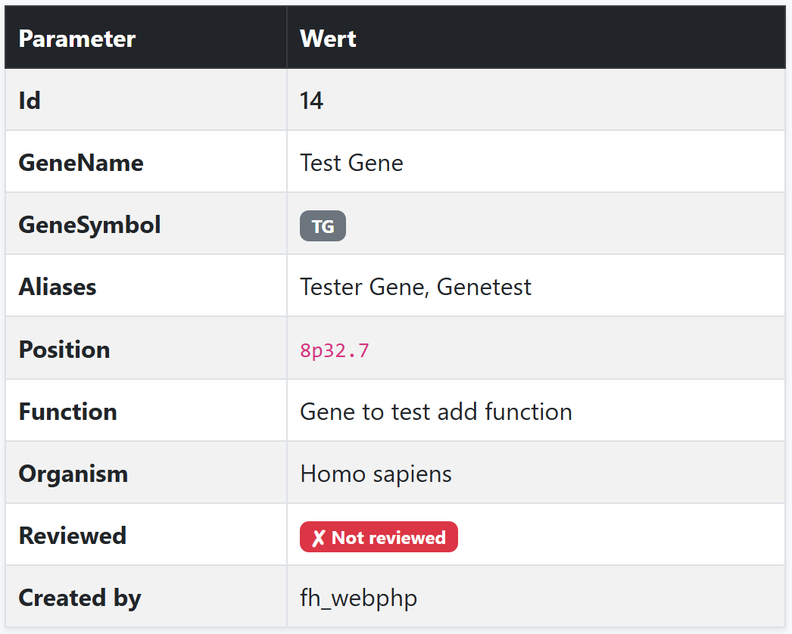

Auch in der Overall Tabelle sieht man das erstellte Gen.

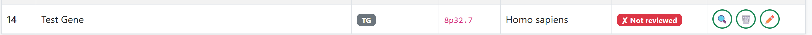

Wenn man ein Gen nur mit required Feldern erstellt sind in der Detailansicht manche Zeilen frei

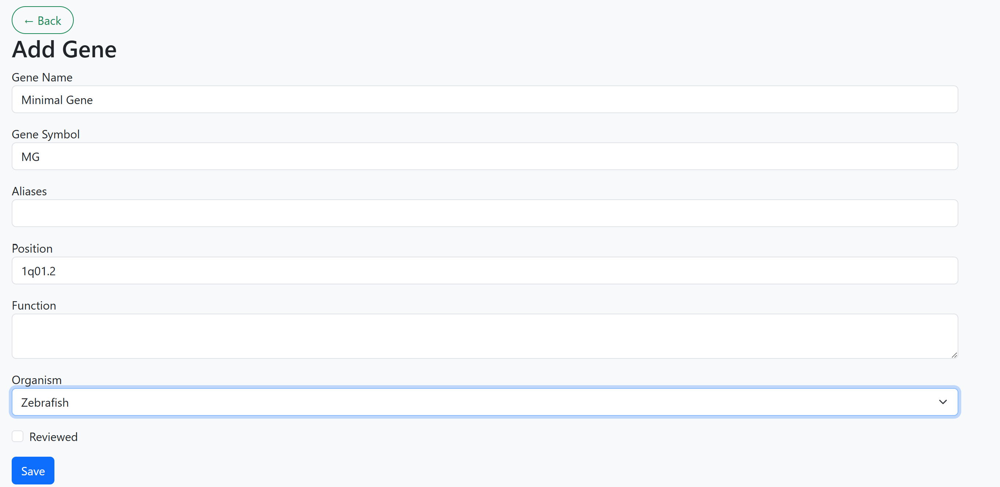

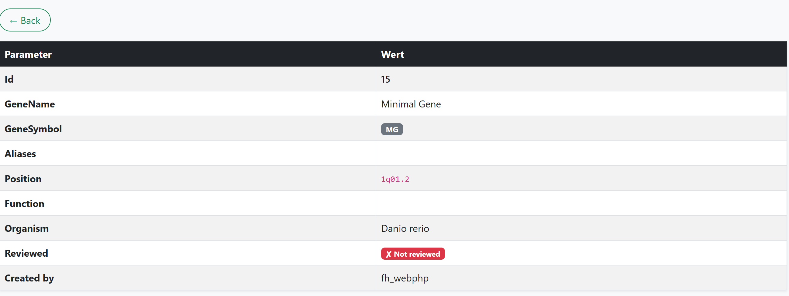

---

Nun soll das Test-Gen editiert werden. Dafür muss der Edit Knopf mit dem Bleistift gedrückt werden.

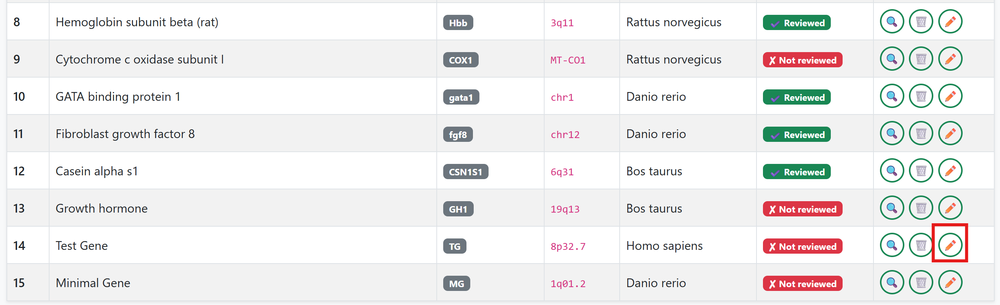

Drückt man den Knopf kommt man zum Bearbeitungsformular. Die Parameter sind bereits ausgefüllt. Im Header steht das zu bearbeitende Gen. Der Back Button führt zurück zur Übersicht.

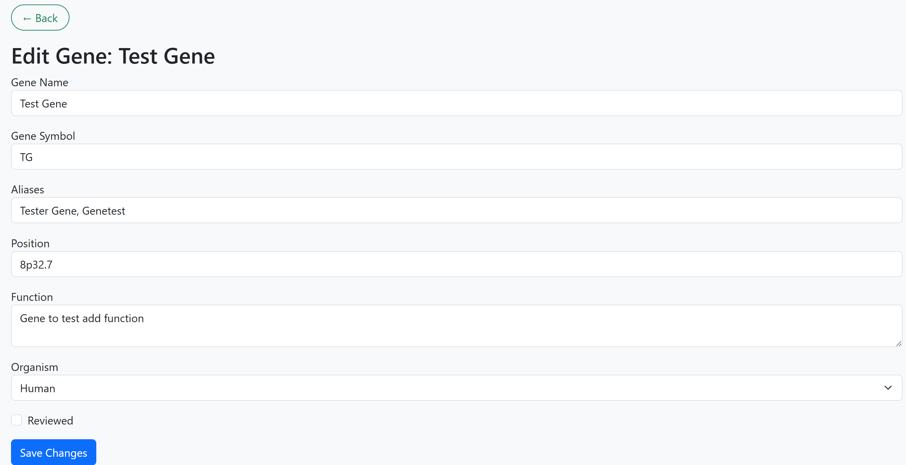

Die im Add genannten Felder sind auch hier required.

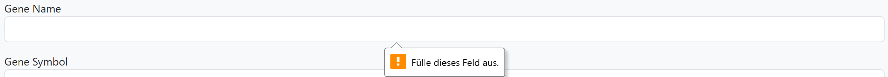

Nun ändern wir Symbol, Position, Organism und setzen den Status auf Reviewed.

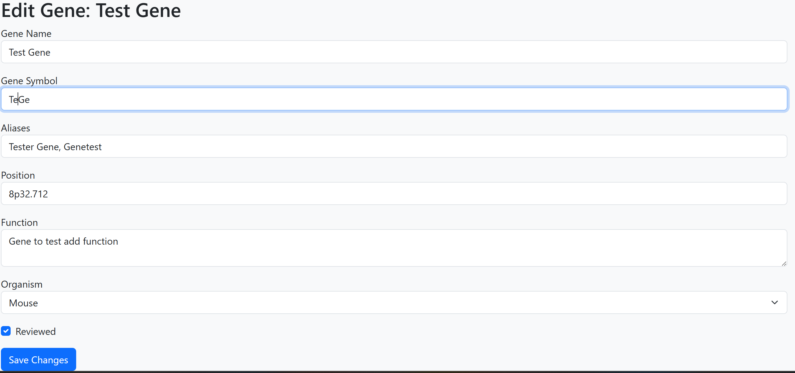

In der Details Page sieht man dann die Änderungen

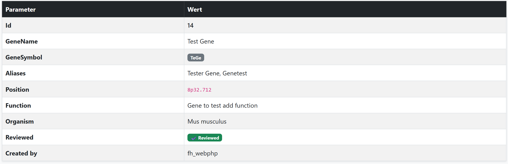

Auch in der Gen Übersicht sieht man die Änderungen

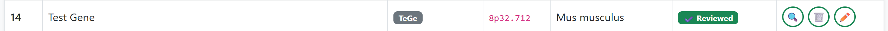

### REST Tests

`database.rest`

Diese Datei testet die grundlegenden Datenbankzugriffe für die Ressource GeneDataItem. Es wird geprüft, ob alle Gene geladen werden können, ob ein einzelnes bestehendes Gen per ID abrufbar ist und ob die CRUD-Operationen Erstellen, Bearbeiten und Löschen über REST-Requests grundsätzlich funktionieren.


`gene.rest`

Diese Datei testet die Gen-Verwaltung ausführlicher. Neben dem Abrufen, Erstellen, Bearbeiten und Löschen von Gen-Datensätzen werden auch Fehlerfälle geprüft, zum Beispiel das Bearbeiten einer nicht vorhandenen ID, fehlende Pflichtfelder und eine ungültige organism_id.


`user.rest`

Diese Datei testet Benutzerfunktionen und Rollenverhalten. Es werden Gastzugang, Registrierung, Login und Logout geprüft. Zusätzlich wird getestet, ob geschützte Admin-Bereiche ohne passende Berechtigung blockiert werden und ob normale Benutzer trotzdem öffentliche Gen-Daten abrufen können.


`userManagement.rest`

Diese Datei testet die Admin-Benutzerverwaltung. Sie prüft das Abrufen der Benutzerliste, das Ändern des Admin-Status, das Löschen von Benutzern sowie Zugriffsschutzfälle wie Admin-Zugriff ohne Login oder Rollenänderungen durch Nicht-Administratoren.


`security.rest`
Diese Datei testet sicherheitsrelevante Fehlerfälle. Dazu gehören ein SQL-Injection-Versuch beim Login, extrem lange Eingaben bei Gen-Daten und ungültige IDs wie eine negative ID beim Löschen. Damit wird geprüft, ob die Anwendung problematische Eingaben abfängt oder zumindest nicht unsicher verarbeitet.


